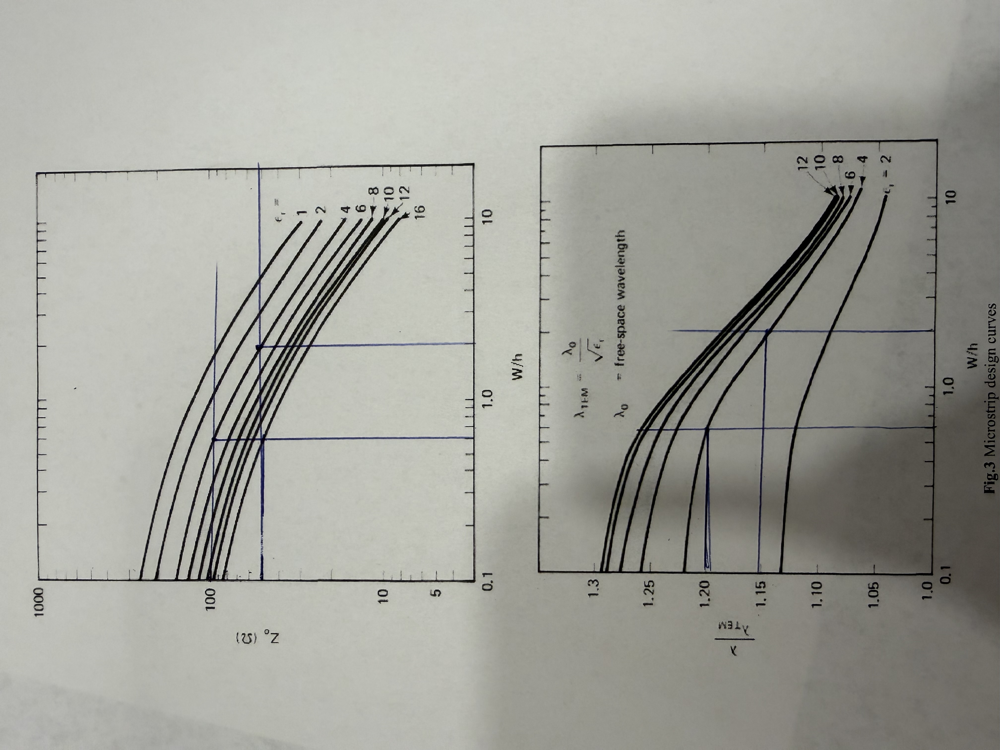
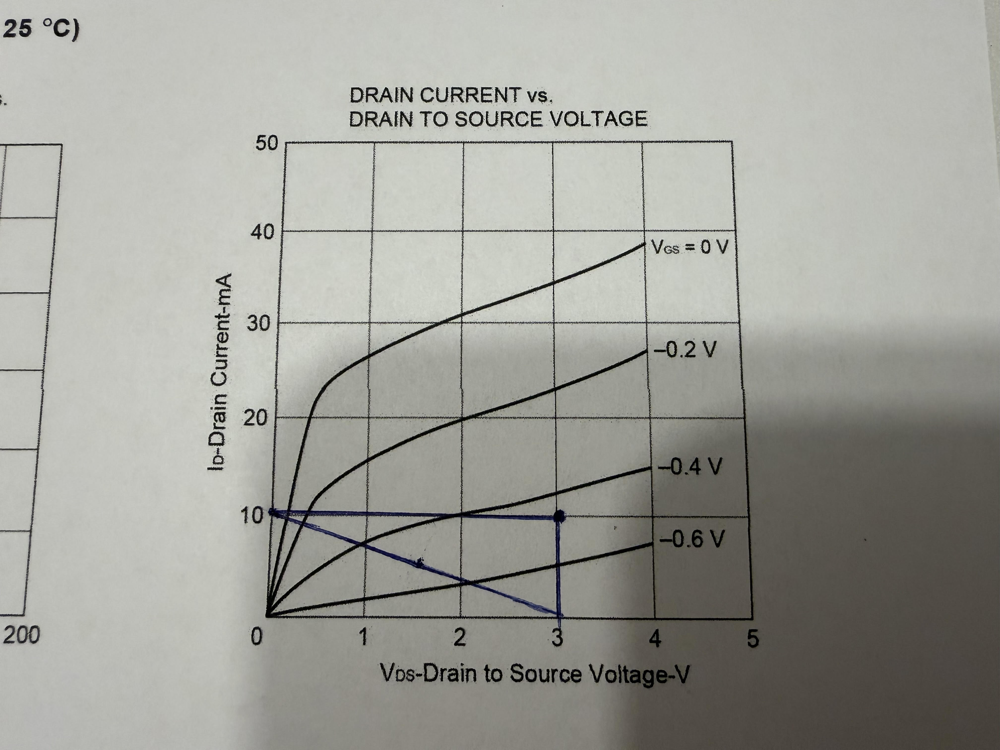
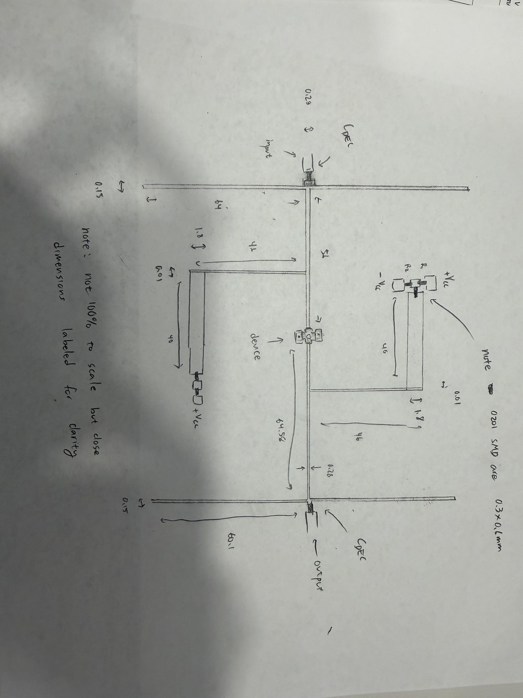

# EECS 182

## Final Project Winter 2026

Goal: Select a suitable device among the 3 provided in the data sheet to design a single stage amplifier to meet the following requirements.

### Requirements

- Gain $G_A > 18\,\text{dB}$
- Noise figure (NF) $\leq 1.7\,\text{dB}$
- Frequency: $1\,\text{GHz}$
- $\text{VSWR}_\text{INPUT} < 3:1$ *(Note this spec is critical and must be met)*
- $\text{VSWR}_\text{OUTPUT} = 1:1$  *(Note this spec is critical and must be met)*
- Stability margin at input $\ge 0.05$
- Stability margin at output $\ge 0.05$

## Project Instructions

1. Analyze the requirements and describe your approach for the design of the amplifier.
2. For each device check stability, if the device is not unconditionally stable draw the stability circles at the input and output on two separate Smith's charts for the input and output plane.
3. For each device draw the available gain circles in the proper plane.
4. For each device draw the noise figure circles in the proper plane.
5. Select the device that satisfy or exceed the requirements specified above, explain your choice and explain why you select one device vs. the other two.
6. For the selected device tune $\Gamma_s$ to trade off between gain, noise figure, stability margins, and `VSWR_IN` / `VSWR_OUT`. Note this last specification **must be met at all costs**.
7. Select the optimum value for the input $\Gamma_s$ accordingly to the amplifier specifications and stability requirements. Pay particular attention to the `VSWR_IN` requirement and make sure you meet this specification.
8. Select the correspondent value of $\Gamma_L$ and verify the stability requirements for it in the proper plane.
9. Use two separate Smith's charts to design the input and output matching networks. Use balanced open stubs having characteristic impedance of $100\,\Omega$ in combination with transmission line to design the matching circuit.
10. Realize your matching circuits in MIC technology using microstrip lines for the matching stub. use open stubs having impedance of $100\,\Omega$. Use Rogers as substrate ($\varepsilon_r = 4$, $h = 0.254\,\text{mm}$) and 201 form factor for the passive components (see Fig. 2) for the bias circuit and the decoupling network.
11. Design the bias network for the device including the decupling capacitors as follow:
    - Use High/Low impedance ($200\,\Omega / 20\,\Omega$) quarter wave line/stub configuration to provide the bias to the gate and drain of the device, the source should be connected to ground through a via hole.
    - Assume differential voltage $V_{CC} = +5\,\text{V} / -5\,\text{V}$ supply is available for the bias of the device.
    - You can assume no current on the gate ($I_G \sim 0$) of the device when biasing the gate ($V_{GS}$), determine the value of the resistors $R1$ and $R2$.
    - Use the I-V curve in the data sheet and draw the proper load line to calculate the resistors $R3$ needed to bias the drain ($V_{DS}$).
    - In addition to their value also compute the power dissipated by each resistor used in the bias network.
    - Compute the values for the choke inductors $L_{CK}$ and decoupling capacitors $C_{DEC}$.
12. Provide a good draw to scale of the circuit layout (make sure it is "to scale") including matching network, bias network and decoupling capacitors.
13. Summarize your final amplifier circuit and performance trade off.
14. If your design cannot meet all the requirements explain why, discuss what you learn during this project and explain your tradeoffs.

Device Specs:

S parameters at $V_{DS} = 3\,\text{V}$, $I_D = 10\,\text{mA}$

NE7684A
- $S_{11}$ mag $0.65$
- $S_{11}$ phase $-135.1$
- $S_{21}$ mag $6.72$
- $S_{21}$ phase $45.0$
- $S_{12}$ mag $0.051$
- $S_{12}$ phase $34.1$
- $S_{22}$ mag $0.487$
- $S_{22}$ phase $-119$

NE7684B
- $S_{11}$ mag $0.580$
- $S_{11}$ phase $-135$
- $S_{21}$ mag $5.40$
- $S_{21}$ phase $45.1$
- $S_{12}$ mag $0.051$
- $S_{12}$ phase $34.7$
- $S_{22}$ mag $0.487$
- $S_{22}$ phase $-119$

NE7684C
- $S_{11}$ mag $0.780$
- $S_{11}$ phase $-15.0$
- $S_{21}$ mag $5.100$
- $S_{21}$ phase $65.0$
- $S_{12}$ mag $0.051$
- $S_{12}$ phase $34.0$
- $S_{22}$ mag $0.587$
- $S_{22}$ phase $77.0$

Step 1:
### Design approach (high level)
At 1 GHz, I evaluate all three devices by:

- Checking stability and plotting input/output stability circles (with required stability margins).
- Plotting available-gain circles and NF circles in the $\Gamma_S$ plane to see whether the gain/noise/stability constraints can overlap.
- Selecting the most feasible device, then sweeping `Gamma_S` and using the corresponding conjugate-match load (`Gamma_L = conj(Gamma_out(Gamma_S))`) to meet the **hard** specs (G_A, NF, and stability margins).
- Synthesizing microstrip matching networks to present the selected `Gamma_S*` and `Gamma_L*` while meeting the **external-port** VSWR requirements.

Step 2: Stability Analysis

### Stability Circle Equations

A two-port network is **unconditionally stable** when the Rollet stability factor $k > 1$ and $|\Delta| < 1$, where:

$$
\Delta = S_{11} S_{22} - S_{12} S_{21}
$$

$$
k = \frac{1 - |S_{11}|^2 - |S_{22}|^2 + |\Delta|^2}{2|S_{12} S_{21}|}
$$

When $k \leq 1$ the device is only **conditionally stable**, so I draw stability circles to identify the stable regions in the $\Gamma_S$ and $\Gamma_L$ planes. In this report, **source** refers to the **input** plane ($\Gamma_S$) and **load** refers to the **output** plane ($\Gamma_L$).

**Load stability circle** (in the $\Gamma_{L}$ plane):

$$
C_{L}=\frac{\left(S_{22}-\Delta\,S_{11}^{\ast}\right)^{\ast}}
{\lvert S_{22}\rvert^{2}-\lvert\Delta\rvert^{2}}
\qquad
r_{L}=\frac{\lvert S_{12}S_{21}\rvert}
{\left|\lvert S_{22}\rvert^{2}-\lvert\Delta\rvert^{2}\right|}
$$

**Source stability circle** (in the $\Gamma_{S}$ plane):

$$
C_{S}=\frac{\left(S_{11}-\Delta\,S_{22}^{\ast}\right)^{\ast}}
{\lvert S_{11}\rvert^{2}-\lvert\Delta\rvert^{2}}
\qquad
r_{S}=\frac{\lvert S_{12}S_{21}\rvert}
{\left|\lvert S_{11}\rvert^{2}-\lvert\Delta\rvert^{2}\right|}
$$

**Determining the stable side:**  
In the $\Gamma_L$ plane, I test the point $\Gamma_L = 0$, which gives $\Gamma_{in} = S_{11}$. So if $|S_{11}| < 1$, the origin is stable in the load plane.  

In the $\Gamma_S$ plane, I test the point $\Gamma_S = 0$, which gives $\Gamma_{out} = S_{22}$. So if $|S_{22}| < 1$, the origin is stable in the source plane.  

I then check whether the origin lies inside or outside the corresponding stability circle. If the origin is outside the circle, the stable region is outside; if the origin is inside, the stable region is inside.

**Stability margin:** I draw a second circle with the same center but radius adjusted by $\pm\,0.05$ to enforce a 0.05 “buffer” from the stability boundary. If the stable region is **outside** the stability circle, the margin circle has radius $r + 0.05$ (pushing the boundary outward), and I require $\Gamma_S$ / $\Gamma_L$ to lie **outside** the margin circle. If the stable region is **inside** the stability circle, the margin circle has radius $r - 0.05$ (shrinking inward), and I require $\Gamma_S$ / $\Gamma_L$ to lie **inside** the margin circle.

### Computed Results

I compute the stability circles for all three devices in `calculation/calculations.py` and plot them via `calculation/graphs.py`. I save the resulting 3 graphs (one per device with source and load subplots) as JPG files under `documentation/`.

**Summary of stability for each device:**

| Device | k | Delta mag | Unconditionally stable? |
|--------|---|-----------|-------------------------|
| NE7684A | 0.5315 | 0.1549 | No (k &lt; 1) |
| NE7684B | 0.8033 | 0.1266 | No (k &lt; 1) |
| NE7684C | 0.2578 | 0.2951 | No (k &lt; 1) |

All three devices are **conditionally stable** ($k < 1$). In every case, the origin ($\Gamma = 0$) lies outside the stability circle, so the **stable region is outside** the circle. The margin circle (red dashed) has radius $r + 0.05$, and I must keep $\Gamma_S$ / $\Gamma_L$ outside that boundary.

Step 3: Gain Circles

### Available Gain Circle Equations

The **available gain** $G_A$ contours are used here as a *design/visualization tool* to show what gain levels are achievable as a function of $\Gamma_S$ under the common “available gain” assumption that the output is conjugate matched (i.e., $\Gamma_L = \Gamma_{out}^\*$). Under this assumption, constant-$G_A$ contours in the $\Gamma_S$ plane are circles. I use the normalized gain $g_A = G_A / |S_{21}|^2$ (with $G_A$ in linear form) and set $g_A = \text{constant}$ to compute each circle’s center and radius.

**Definitions:**
- $C_1 = S_{11} - \Delta S_{22}^*$
- $g_A = G_A / |S_{21}|^2$ where $G_A$ is linear (convert from dB via $G_{A,\text{lin}} = 10^{G_{A,\text{dB}}/10}$)

**For each constant gain level $G_A$:**
- Denominator: $D_A = 1 + g_A\,(|S_{11}|^2 - |\Delta|^2)$
- **Center** (in the $\Gamma_S$ plane): $c_A = \dfrac{g_A\,C_1^*}{D_A}$
- **Radius**: $r_A = \dfrac{\sqrt{1 - 2k\,|S_{12}S_{21}|\,g_A + (|S_{12}S_{21}|\,g_A)^2}}{|D_A|}$

These circles are drawn in the **$\Gamma_S$ (source) plane** because available gain depends on the source reflection coefficient when the load is conjugate-matched.

### Gain Levels and Implementation

I draw gain circles at **18, 19, 20, 21, 22, 23, and 24 dB** to cover the requirement ($G_A > 18\,\text{dB}$) and higher design options. The calculations are implemented in `calculation/calculations.py` and the plots are generated by `calculation/graphs.py`. Each figure overlays the input stability circle and margin circle so that the intersection of gain and stability constraints is visible.

### Computed Results

Step 4: Noise Circles

### Noise Figure Circle Equations

The device noise is described by four **noise parameters** at 1 GHz: minimum noise figure $NF_{min}$, optimum source reflection coefficient $\Gamma_{opt}$, and normalized noise resistance $R_n/Z_0$. The noise figure depends on the source reflection coefficient $\Gamma_S$, so constant-noise-figure contours are drawn in the **$\Gamma_S$ plane**.

Convert noise figures from dB to linear noise factors:

$$
F = 10^{NF/10}, \qquad F_{min} = 10^{NF_{min}/10}
$$

The noise factor as a function of $\Gamma_S$ is:

$$
F(\Gamma_S) = F_{min} + \frac{4(R_n/Z_0)\,|\Gamma_S - \Gamma_{opt}|^2}{(1-|\Gamma_S|^2)\,|1+\Gamma_{opt}|^2}
$$

For a **constant** noise figure $F$, define the parameter:

$$
N = \frac{(F - F_{min})\,|1+\Gamma_{opt}|^2}{4(R_n/Z_0)}
$$

Then the constant-noise-figure circle has:

$$
c_N = \frac{\Gamma_{opt}}{1+N},
\qquad
r_N = \frac{\sqrt{N^2 + N(1-|\Gamma_{opt}|^2)}}{|1+N|}
$$

### 1.7 dB Circle and Direction to Lower Noise

The project requirement is **NF $\leq 1.7$ dB**, so I plot the **1.7 dB** noise circle for each device using the noise parameters in `calculation/constants.py` and the equations above (implemented in `calculation/calculations.py`, plotted in `calculation/graphs.py`).

**Minimum noise occurs at $\Gamma_S = \Gamma_{opt}$.** Moving **toward $\Gamma_{opt}$** reduces noise figure; moving **away** increases noise figure. On each plot I mark $\Gamma_{opt}$ and draw an arrow pointing toward it (labeled “Lower NF”).

### Computed Results

Step 5: Selecting the Device

### Combined Constraint Plots

To select the best device, I overlay **gain circles (18–24 dB)**, the **NF = 1.7 dB** noise circle, and the **input stability + margin** circle in the **$\Gamma_S$ plane**, and also show the **output stability + margin** circle in the **$\Gamma_L$ plane** (right subplot). This makes it easy to see whether there is a feasible $\Gamma_S$ region that can meet **gain**, **noise**, and **stability margin** simultaneously.

### Device Choice

From the combined plots and the provided 1 GHz parameters:

- **NE7684B (rejected)**: is not feasible for the requirements because the **$G_A=18$ dB** gain circle does **not** overlap with the region that satisfies **NF $\le 1.7$ dB**. This means there is no $\Gamma_S$ that meets both the gain and noise requirements at the same time.

- **NE7684A (selected)**: offers the best tradeoff because it has the **highest forward gain** (largest $|S_{21}|$) and the **lowest $NF_{min}$**. In the $\Gamma_S$ overlay plot there is a clear overlap between the **NF $\le 1.7$ dB** region and the available-gain circles, and the NF boundary reaches into the **about 21 dB** gain-circle region.

- **NE7684C (works but worse)**: can work, but has a **smaller overlap** region and a worse tradeoff. For example, the NF boundary only reaches into the **about 20 dB** gain-circle region. NE7684C also has the **lowest $k$** (least stable), so meeting constraints like **`VSWR_IN`** during tuning is likely harder.

Therefore I proceed with **NE7684A** for the remaining design steps.

Step 6: Device Tuning

### Device Tuning Sweep

For the selected device (**NE7684A**) at 1 GHz, I sweep `Gamma_S` over the stable region and use the **available-gain (conjugate-match) framework** consistently:

- For each candidate `Gamma_S`, compute the output reflection coefficient `Gamma_out(Gamma_S)` of the transistor.
- Set the load termination to the **corresponding conjugate-match load**:
  - `Gamma_L = conj(Gamma_out(Gamma_S))`
- Evaluate the design metrics at that point:
  - available gain `G_A(Gamma_S)` (must exceed 18 dB)
  - noise figure `NF(Gamma_S)` (must be ≤ 1.7 dB)
  - input/output stability margins (must both be ≥ 0.05)

Note: I still compute a **device-plane** input VSWR based on `Gamma_in`, but this is an informational transistor-plane metric. The project’s VSWR requirement applies to the **external amplifier input port**, which is verified after the matching network is synthesized in Step 9.

#### Stability margins
I enforce the stability margin constraints using signed distance to the stability-circle boundaries in both planes:
- source plane uses Gamma = Gamma_S
- load plane uses Gamma = Gamma_L
with the requirement that both margins are $\ge 0.05$.

#### Sweep and refinement outputs
I run a coarse `Gamma_S` sweep and then refine locally around the best feasible point (ranked by higher `G_A`, then lower `NF`, then larger minimum stability margin).

Outputs are saved as:
- `documentation/NE7684A_step6_sweep.csv`
- `documentation/NE7684A_step6_refined_sweep.csv`

All feasible points satisfy the hard constraints (G_A > 18 dB, NF ≤ 1.7 dB, and stability margins ≥ 0.05). I rank feasible points primarily by **higher G_A**, then **lower NF**, then **larger minimum stability margin**.

**NE7684A best refined feasible point (selected):**
- `Gamma_S*` ≈ -0.198111 + j0.480831
- `Gamma_L*` ≈ -0.490536 + j0.429297 (computed as `conj(Gamma_out(Gamma_S*))`)
- `G_A` ≈ 20.673 dB, `NF` ≈ 1.408 dB
- stability margins: `m_in` ≈ 0.343, `m_out` ≈ 0.050

Step 7: Select the optimum input Gamma_S

### Definition of “optimum” and hard constraints
Here I use `Gamma_S` (same as `Gamma_s` in the project statement) to denote the source/input reflection coefficient. The optimum `Gamma_S` is selected from the feasible region in the `Gamma_S` plane that simultaneously satisfies:

- **Gain**: `G_A(Gamma_S) > 18 dB`
- **Noise**: `NF(Gamma_S) <= 1.7 dB`
- **Input-plane stability margin**: `m_in >= 0.05` (per the stability-margin construction in Step 2)
- **Output-plane stability margin (with conjugate match load)**: `m_out >= 0.05` when `Gamma_L = conj(Gamma_out(Gamma_S))`

### Selected optimum Gamma_S
From the refined available-gain sweep for **NE7684A**, the selected optimum input termination is:

- `Gamma_S*` ≈ -0.198111 + j0.480831

At this point the design meets all hard constraints:
- `G_A` ≈ 20.673 dB
- `NF` ≈ 1.408 dB
- stability margins: `m_in` ≈ 0.343 >= 0.05, `m_out` ≈ 0.050 >= 0.05

Step 8: Select the corresponding Gamma_L and verify stability requirements

Under the available-gain (conjugate-match) framework, the corresponding load is computed from:

$$
\Gamma_{out}=S_{22}+\frac{S_{12}S_{21}\Gamma_S}{1-S_{11}\Gamma_S}
$$

and

$$
\Gamma_L^\star=\Gamma_{out}^\*
$$

So the corresponding output termination for the selected `Gamma_S*` is:

- `Gamma_L*` ≈ -0.490536 + j0.429297

### Output-plane stability margin verification
Using the output stability circle and margin circle defined in Step 2, `Gamma_L*` must lie in the **stable region** and satisfy the required stability margin:

- output stability margin: `m_out` ≈ 0.050 >= 0.05

### Note on the VSWR_OUT = 1:1 requirement
The project requirement `VSWR_OUT = 1:1` is an **external-port** requirement. In Steps 9–10, the output matching network will be synthesized to present the device with `Gamma_L*` while maintaining a matched 50-ohm output port.

### Step 9 matching network topology choice (balanced 100 $\Omega$ open stubs on a 50 $\Omega$ line)
At 1 GHz with $Z_0=50\,\Omega$, the selected reflection coefficients correspond to the following target impedances at the device reference planes:

$$
Z_S^\star = Z_0\frac{1+\Gamma_S^\star}{1-\Gamma_S^\star}\approx (21.89 + j28.85)\,\Omega
$$

$$
Z_L^\star = Z_0\frac{1+\Gamma_L^\star}{1-\Gamma_L^\star}\approx (11.95 + j17.84)\,\Omega
$$

Per the project constraint, I implement both matching networks using a **50 $\Omega$ through line** and **balanced open stubs** with characteristic impedance **$Z_{0,stub}=100\,\Omega$**. “Balanced” means **two identical 100 $\Omega$ open stubs in parallel at the same shunt node** (symmetric layout, doubled susceptance).

For an open-circuited stub of characteristic impedance $Z_{0,stub}$ and electrical length $\theta=\beta l$, the input admittance is:

$$
Y_{stub}=j\frac{1}{Z_{0,stub}}\tan(\theta)
$$

Two identical stubs in parallel give:

$$
Y_{eq}=2Y_{stub}=j\frac{2}{100}\tan(\theta)=j\frac{1}{50}\tan(\theta)
$$

So, **when normalized to 50 $\Omega$**, the balanced stub pair contributes a **pure shunt susceptance**

$$
y_{eq}=j\tan(\theta)
$$
This is equivalent (in normalized admittance) to a **single 50 $\Omega$ open stub** at the same electrical length.
For Smith-chart synthesis, this balanced 2×100 $\Omega$ stub pair is treated as an **ideal equivalent shunt susceptance** at the shunt node.

### Distributed matching network form used in Step 9
On each Smith chart I use a distributed two-element form that is directly realizable with microstrip:

- **Series 50 $\Omega$ line section(s)** (electrical length $\theta$): moves along a constant-$|\Gamma|$ circle (phase rotation).
- **Shunt balanced open-stub pair** (two identical 100 $\Omega$ stubs of electrical length $\theta_s$ at one node): adds a pure susceptance in the **admittance** plane, $y\rightarrow y + j\tan(\theta_s)$.

This provides the same degrees of freedom as an L-match, but implemented with the required **50 $\Omega$ line + balanced 100 $\Omega$ open stubs**.

#### Verification notes (constraints carried forward)
- **Device-plane check (informational):** compute the loaded-device `Gamma_in` and device-plane VSWR as an informational metric (not the external-port spec).
- **Output-plane stability margin:** verify `Gamma_L*` satisfies the Step 2 margin requirement in the `Gamma_L` plane (for the selected point, `m_out` ≈ 0.050).
- **External-port match (after synthesis):** verify `VSWR_IN < 3:1` and `VSWR_OUT = 1:1` at the external 50-ohm ports for the full network.

Step 9: Smith-chart design of the input and output matching networks

To synthesize the matching networks, I use **two separate Smith charts** (one in the Gamma_S plane for the input match and one in the Gamma_L plane for the output match). Each chart shows the target reflection coefficient at 1 GHz (from Step 7–8) and one matching trajectory realizable with the required **series 50-ohm line** and **shunt balanced 2×100-ohm open stubs**.

#### Correct single-shunt-stub synthesis sequence
For a single shunt-stub match, the synthesis is done from the **target plane** back toward the 50-ohm port:

1. Start from the target reflection coefficient (device plane).
2. Move along a 50-ohm line by `theta_line` until the normalized admittance at the stub node has real part 1:
   - `y(theta_line) = 1 + j*b`
3. Add the balanced open-stub pair (normalized susceptance `+j*tan(theta_stub)`) to cancel the imaginary part:
   - choose `tan(theta_stub) = -b`
4. The external port is then matched (Gamma ≈ 0, VSWR ≈ 1:1 for the ideal lossless network).

**Input (gate) Smith chart (Gamma_S plane):** one valid electrical-length solution at 1 GHz is:

- series 50-ohm line before stub node: theta_port = 0.00 degrees
- series 50-ohm line from stub node to device: theta_line ≈ 116.87 degrees
- each 100-ohm open stub: theta_stub ≈ 129.39 degrees

Equivalent lumped element at 1 GHz (balanced pair at the stub node):
- tan(theta_stub) ≈ -1.2178 → `B_total` ≈ -0.02436 S
- This corresponds to an **inductive** shunt element at 1 GHz:
  - `L_eq` ≈ 6.53 nH total (about 13.07 nH per 100-ohm stub)

**Output (drain) Smith chart (Gamma_L plane):** one valid electrical-length solution at 1 GHz is:

- series 50-ohm line before stub node: theta_port = 0.00 degrees
- series 50-ohm line from stub node to device: theta_line ≈ 134.74 degrees
- each 100-ohm open stub: theta_stub ≈ 120.19 degrees

Equivalent lumped element at 1 GHz (balanced pair at the stub node):
- tan(theta_stub) ≈ -1.7190 → `B_total` ≈ -0.03438 S
- This corresponds to an **inductive** shunt element at 1 GHz:
  - `L_eq` ≈ 4.63 nH total (about 9.26 nH per 100-ohm stub)

Step 10 (handoff): MIC realization of the Step 9 microstrip sections

In Step 10, I convert the Step 9 electrical lengths to **physical microstrip lengths** on Rogers substrate ($\varepsilon_r=4$, $h=0.254\,\text{mm}$) using the provided microstrip design curves:

- **Determine widths** from the design curves:
  - $W_{50}$ for a 50 $\Omega$ microstrip line (through line sections)
  - $W_{100}$ for a 100 $\Omega$ microstrip line (each open stub)
- **Design-curve results used (at $\varepsilon_r=4$)**:
  - 50-ohm microstrip: `W/h ≈ 1.1`, lambda ratio ≈ 1.15
  - 100-ohm microstrip: `W/h ≈ 0.6`, lambda ratio ≈ 1.2
- **Determine guided wavelength** for each impedance class (because $W/h$ differs):
  - $\lambda_{g,50}$ for the 50 $\Omega$ line
  - $\lambda_{g,100}$ for the 100 $\Omega$ stub line
- **Convert electrical length to physical length**:

$$
\lambda_0=\frac{c}{f},\qquad \lambda_{TEM}=\frac{\lambda_0}{\sqrt{\varepsilon_r}}
$$

The design-curve “lambda ratio” is given as $\lambda/\lambda_{TEM}$, so:

$$
\lambda_g=\lambda=\left(\frac{\lambda}{\lambda_{TEM}}\right)\lambda_{TEM}=\left(\text{lambda ratio}\right)\frac{\lambda_0}{\sqrt{\varepsilon_r}}
$$

$$
l=\frac{\theta}{2\pi}\,\lambda_g
$$

Using $\lambda_{g,50}$ for the 50 $\Omega$ sections ($\theta_1$, $\theta_2$) and $\lambda_{g,100}$ for each 100 $\Omega$ open stub ($\theta_s$).

#### Numeric lengths at 1 GHz (h = 0.254 mm, epsilon_r = 4)
At 1 GHz, $\lambda_0 = 300$ mm and $\lambda_{TEM}=\lambda_0/\sqrt{\varepsilon_r}=300/2=150$ mm. Using the design-curve lambda ratios ($\lambda/\lambda_{TEM}$):
- 50-ohm line: $\lambda_{g,50} \approx 1.15\cdot 150 = 172.50$ mm
- 100-ohm stub: $\lambda_{g,100} \approx 1.2\cdot 150 = 180.00$ mm

Using the Step 9 electrical lengths:

- Input match (50-ohm line from stub node to device, theta_line ≈ 116.87°):
  - length ≈ (116.87/360)·172.50 mm ≈ **56.00 mm**
- Input match (each 100-ohm open stub, theta_stub ≈ 129.39°):
  - length ≈ (129.39/360)·180.00 mm ≈ **64.70 mm**

- Output match (50-ohm line from stub node to device, theta_line ≈ 134.74°):
  - length ≈ (134.74/360)·172.50 mm ≈ **64.58 mm**
- Output match (each 100-ohm open stub, theta_stub ≈ 120.19°):
  - length ≈ (120.19/360)·180.00 mm ≈ **60.10 mm**

Step 11: Bias network (high/low impedance quarter-wave feed, DC bias resistors, and decoupling)

The bias network must provide DC gate and drain bias while isolating the RF path. The project specifies a high/low impedance quarter-wave configuration using 200-ohm / 20-ohm microstrip sections, plus a resistive gate divider, a drain bias resistor from the +5 V rail, and choke/decoupling components.

### Gate bias (R1, R2) using +5 V / -5 V rails
From the I-V curve, I estimate a gate-source bias of approximately:
- VGS ~ -0.47 V (estimated between the -0.4 V and -0.6 V curves)

Assuming IG ~ 0, I set the gate voltage using a divider between +5 V and -5 V:
- R1 from +5 V to the gate node
- R2 from the gate node to -5 V

With source at RF ground, the divider target is VG ~ -0.47 V. Given that the supply rails are +5 V and -5 V, and assuming IG ~ 0, the divider relationship is:

- VG = -5 + 10·(R2/(R1+R2))

Solving for VG ~ -0.47 V gives R2/(R1+R2) ~ 0.453, so one practical choice is R1+R2 = 10 kOhm:

- R1 ~ 5.47 kOhm (to +5 V)
- R2 ~ 4.53 kOhm (to -5 V)
- Divider current: Idiv = 10 V / 10 kOhm = 1.00 mA
- Power: PR1 ~ 5.47 mW, PR2 ~ 4.53 mW

### Drain bias (R3) for VDS = 3 V at ID = 10 mA
With the drain fed from +5 V through R3 and targeting VDS = 3 V at ID = 10 mA:
- R3 = (5 - 3)/0.01 = 200 ohm
- PR3 = ID^2 * R3 = 20 mW

### Choke inductor (LCK) and decoupling capacitor (CDEC) at 1 GHz
To meet the specified RF-impedance screening at 1 GHz:
- decoupling capacitor target: |ZC| < 1 ohm
- choke inductor target: |ZL| > 10 kohm

Using |ZC| = 1/(wC) and |ZL| = wL at f = 1 GHz:
- CDEC > 1/w = 159.2 pF
- LCK > 10k/w = 1.592 uH

### Microstrip implementation of 20-ohm / 200-ohm quarter-wave bias sections (formulas, not curves)
The provided microstrip design curves do not include 200 ohm, so I compute w/h and guided wavelength using closed-form microstrip equations (quasi-TEM). For epsilon_r = 4 and h = 0.254 mm at 1 GHz:

- 20-ohm microstrip:
  - w/h ~ 7.3437 -> W ~ 1.8653 mm
  - epsilon_eff ~ 3.4242
  - lambda_g ~ 162.01 mm -> quarter-wave length ~ 40.50 mm

- 200-ohm microstrip:
  - w/h ~ 0.0377 -> W ~ 0.0096 mm
  - epsilon_eff ~ 2.5839
  - lambda_g ~ 186.50 mm -> quarter-wave length ~ 46.63 mm

These 20-ohm / 200-ohm quarter-wave sections are used to feed the gate and drain bias while providing RF isolation at 1 GHz.

Part 12: Drawing Layout

Note: while the drawing is not 100% to scale, it is pretty close since I did it by hand. Dimensions are provided and labelled for clarity.

Part 13: Final amplifier circuit and performance tradeoff

**Final topology (1 GHz):**
- Selected device: NE7684A, biased at VDS = 3 V and ID = 10 mA
- Input match: 50-ohm line + balanced 2×100-ohm open stubs to present `Gamma_S*` at the device plane and match the external input port
- Output match: 50-ohm line + balanced 2×100-ohm open stubs to present `Gamma_L*` at the device plane and match the external output port
- Bias network: gate divider from +5 V / -5 V to set VG ~ -0.47 V, drain resistor R3 = 200 ohm from +5 V, and quarter-wave high/low impedance bias feeds with decoupling/choke components

**Selected terminations (device plane):**
- `Gamma_S*` ≈ -0.198111 + j0.480831
- `Gamma_L*` ≈ -0.490536 + j0.429297 (conjugate-match load from `Gamma_out(Gamma_S*)`)

**Key performance at 1 GHz (device-plane metrics):**
- Available gain: G_A ≈ 20.673 dB (> 18 dB requirement)
- Noise figure: NF ≈ 1.408 dB (≤ 1.7 dB requirement)
- Stability margins: m_in ≈ 0.343 and m_out ≈ 0.050 (both ≥ 0.05 requirement)

**Tradeoffs:**
- The selected point prioritizes meeting the hard gain/NF/stability-margin constraints under the available-gain (conjugate-match) framework.
- The output stability margin is tight (~0.050), so the final realized layout should preserve electrical lengths accurately to maintain margin.

Part 14: If the design cannot meet all requirements

N/A (design meets the specified requirements).

