# EECS 182

## Final Project Winter 2026

Goal: Select a suitable device among the 3 provided in the data sheet to design a single stage amplifier to meet the following requirements.

### Requirements

- Gain $G_A > 18\,\text{dB}$
- Noise figure (NF) $\leq 1.7\,\text{dB}$
- Frequency: $1\,\text{GHz}$
- $\text{VSWR}_\text{INPUT} < 3:1$ *(Note this spec is critical and must be met)*
- $\text{VSWR}_\text{OUTPUT} = 1:1$  *(Note this spec is critical and must be met)*
- Stability margin at input $\ge 0.05$
- Stability margin at output $\ge 0.05$

## Project Instructions

1. Analyze the requirements and describe your approach for the design of the amplifier.
2. For each device check stability, if the device is not unconditionally stable draw the stability circles at the input and output on two separate Smith's charts for the input and output plane.
3. For each device draw the available gain circles in the proper plane.
4. For each device draw the noise figure circles in the proper plane.
5. Select the device that satisfy or exceed the requirements specified above, explain your choice and explain why you select one device vs. the other two.
6. For the selected device tune $\Gamma_s$ to trade off between gain, noise figure, stability margins, and $\mathrm{VSWR}_{IN}/\mathrm{VSWR}_{OUT}$. Note this last specification **must be met at all costs**.
7. Select the optimum value for the input $\Gamma_s$ accordingly to the amplifier specifications and stability requirements. Pay particular attention to the $\mathrm{VSWR}_{IN}$ requirement and make sure you meet this specification.
8. Select the correspondent value of $\Gamma_L$ and verify the stability requirements for it in the proper plane.
9. Use two separate Smith's charts to design the input and output matching networks. Use balanced open stubs having characteristic impedance of $100\,\Omega$ in combination with transmission line to design the matching circuit.
10. Realize your matching circuits in MIC technology using microstrip lines for the matching stub. use open stubs having impedance of $100\,\Omega$. Use Rogers as substrate ($\varepsilon_r = 4$, $h = 0.254\,\text{mm}$) and 201 form factor for the passive components (see Fig. 2) for the bias circuit and the decoupling network.
11. Design the bias network for the device including the decupling capacitors as follow:
    - Use High/Low impedance ($200\,\Omega / 20\,\Omega$) quarter wave line/stub configuration to provide the bias to the gate and drain of the device, the source should be connected to ground trough a via hole.
    - Assume differential voltage $V_{CC} = +5\,\text{V} / -5\,\text{V}$ supply is available for the bias of the device.
    - You can assume no current on the gate ($I_G \sim 0$) of the device when biasing the gate ($V_{GS}$), determine the value of the resistors $R1$ and $R2$.
    - Use the I-V curve in the data sheet and draw the proper load line to calculate the resistors $R3$ needed to bias the drain ($V_{DS}$).
    - In addition to their value also compute the power dissipated by each resistor used in the bias network.
    - Compute the values for the choke inductors $L_{CK}$ and decoupling capacitors $C_{DEC}$.
12. Provide a good draw to scale of the circuit layout (make sure it is "to scale") including matching network, bias network and decoupling capacitors.
13. Summarize your final amplifier circuit and performance trade off.
14. If your design cannot meet all the requirements explain why, discuss what you learn during this project and explain your tradeoffs.

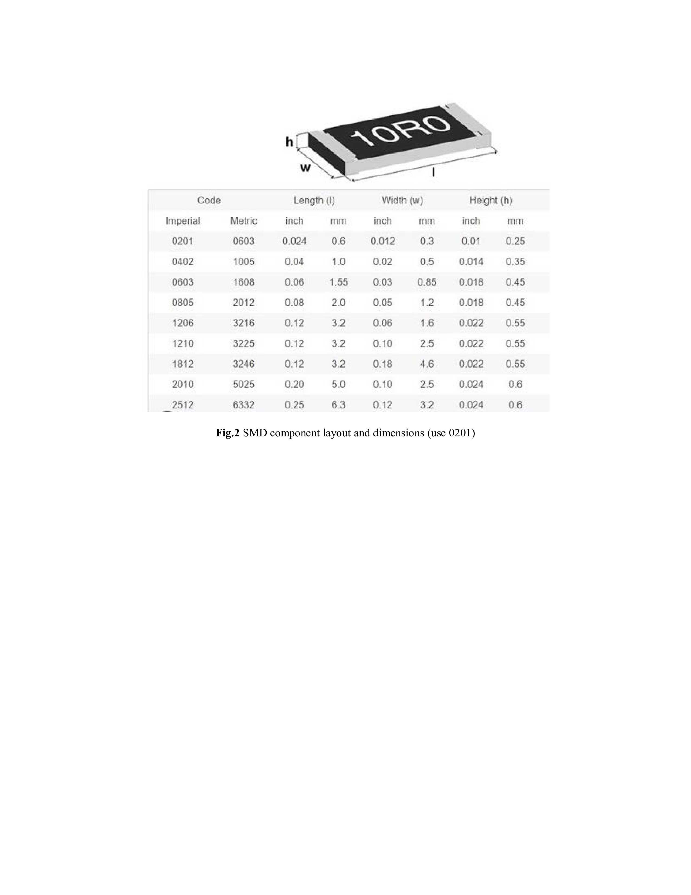
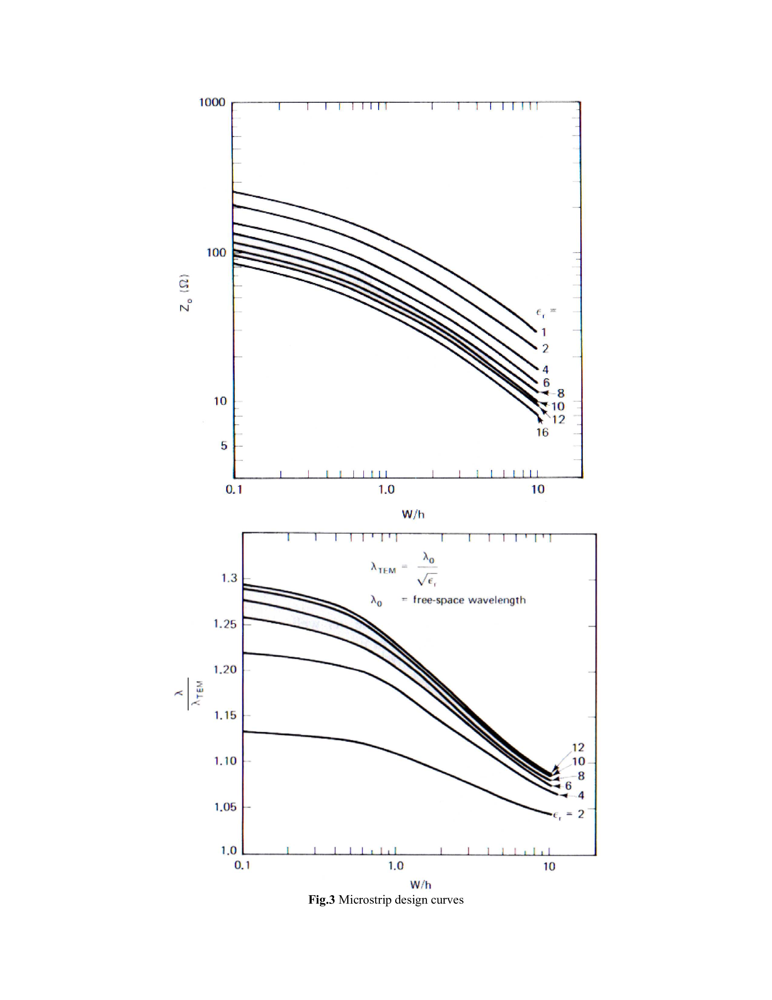

Device Specs:

S parameters at $V_{DS} = 3\,\text{V}$, $I_D = 10\,\text{mA}$

NE7684A
- $S_{11}$ mag $0.65$
- $S_{11}$ phase $-135.1$
- $S_{21}$ mag $6.72$
- $S_{21}$ phase $45.0$
- $S_{12}$ mag $0.051$
- $S_{12}$ phase $34.1$
- $S_{22}$ mag $0.487$
- $S_{22}$ phase $-119$

NE7684B
- $S_{11}$ mag $0.580$
- $S_{11}$ phase $-135$
- $S_{21}$ mag $5.40$
- $S_{21}$ phase $45.1$
- $S_{12}$ mag $0.051$
- $S_{12}$ phase $34.7$
- $S_{22}$ mag $0.487$
- $S_{22}$ phase $-119$

NE7684C
- $S_{11}$ mag $0.780$
- $S_{11}$ phase $-15.0$
- $S_{21}$ mag $5.100$
- $S_{21}$ phase $65.0$
- $S_{12}$ mag $0.051$
- $S_{12}$ phase $34.0$
- $S_{22}$ mag $0.587$
- $S_{22}$ phase $77.0$

Step 1:
### Design approach (high level)
At 1 GHz, I evaluate all three devices by:

- Checking stability and plotting input/output stability circles (with required stability margins).
- Plotting available-gain circles and NF circles in the $\Gamma_S$ plane to see whether the gain/noise/stability constraints can overlap.
- Selecting the most feasible device, then performing a joint $\Gamma_S$–$\Gamma_L$ termination sweep to satisfy the **hard** specs (gain, NF, stability margins, and the critical input VSWR constraint).
- Synthesizing microstrip matching networks to present the selected $\Gamma_S^\star$ and $\Gamma_L^\star$ while meeting the **external-port** VSWR requirements.

Step 2: Stability Analysis

### Stability Circle Equations

A two-port network is **unconditionally stable** when the Rollet stability factor $k > 1$ and $|\Delta| < 1$, where:

$$
\Delta = S_{11} S_{22} - S_{12} S_{21}
$$

$$
k = \frac{1 - |S_{11}|^2 - |S_{22}|^2 + |\Delta|^2}{2|S_{12} S_{21}|}
$$

When $k \leq 1$ the device is only **conditionally stable**, so I draw stability circles to identify the stable regions in the $\Gamma_S$ and $\Gamma_L$ planes. In this report, **source** refers to the **input** plane ($\Gamma_S$) and **load** refers to the **output** plane ($\Gamma_L$).

**Load stability circle** (in the $\Gamma_{L}$ plane):

$$
C_{L}=\frac{\left(S_{22}-\Delta\,S_{11}^{\ast}\right)^{\ast}}
{\lvert S_{22}\rvert^{2}-\lvert\Delta\rvert^{2}}
\qquad
r_{L}=\frac{\lvert S_{12}S_{21}\rvert}
{\left|\lvert S_{22}\rvert^{2}-\lvert\Delta\rvert^{2}\right|}
$$

**Source stability circle** (in the $\Gamma_{S}$ plane):

$$
C_{S}=\frac{\left(S_{11}-\Delta\,S_{22}^{\ast}\right)^{\ast}}
{\lvert S_{11}\rvert^{2}-\lvert\Delta\rvert^{2}}
\qquad
r_{S}=\frac{\lvert S_{12}S_{21}\rvert}
{\left|\lvert S_{11}\rvert^{2}-\lvert\Delta\rvert^{2}\right|}
$$

**Determining the stable side:**  
In the $\Gamma_L$ plane, I test the point $\Gamma_L = 0$, which gives $\Gamma_{in} = S_{11}$. So if $|S_{11}| < 1$, the origin is stable in the load plane.  

In the $\Gamma_S$ plane, I test the point $\Gamma_S = 0$, which gives $\Gamma_{out} = S_{22}$. So if $|S_{22}| < 1$, the origin is stable in the source plane.  

I then check whether the origin lies inside or outside the corresponding stability circle. If the origin is outside the circle, the stable region is outside; if the origin is inside, the stable region is inside.

**Stability margin:** I draw a second circle with the same center but radius adjusted by $\pm\,0.05$ to enforce a 0.05 “buffer” from the stability boundary. If the stable region is **outside** the stability circle, the margin circle has radius $r + 0.05$ (pushing the boundary outward), and I require $\Gamma_S$ / $\Gamma_L$ to lie **outside** the margin circle. If the stable region is **inside** the stability circle, the margin circle has radius $r - 0.05$ (shrinking inward), and I require $\Gamma_S$ / $\Gamma_L$ to lie **inside** the margin circle.

### Computed Results

I compute the stability circles for all three devices in `calculation/calculations.py` and plot them via `calculation/graphs.py`. I save the resulting 3 graphs (one per device with source and load subplots) as JPG files under `documentation/`.

**Summary of stability for each device:**

| Device | k | Delta mag | Unconditionally stable? |
|--------|---|-----------|-------------------------|
| NE7684A | 0.5315 | 0.1549 | No (k &lt; 1) |
| NE7684B | 0.8033 | 0.1266 | No (k &lt; 1) |
| NE7684C | 0.2578 | 0.2951 | No (k &lt; 1) |

All three devices are **conditionally stable** ($k < 1$). In every case, the origin ($\Gamma = 0$) lies outside the stability circle, so the **stable region is outside** the circle. The margin circle (red dashed) has radius $r + 0.05$, and I must keep $\Gamma_S$ / $\Gamma_L$ outside that boundary.

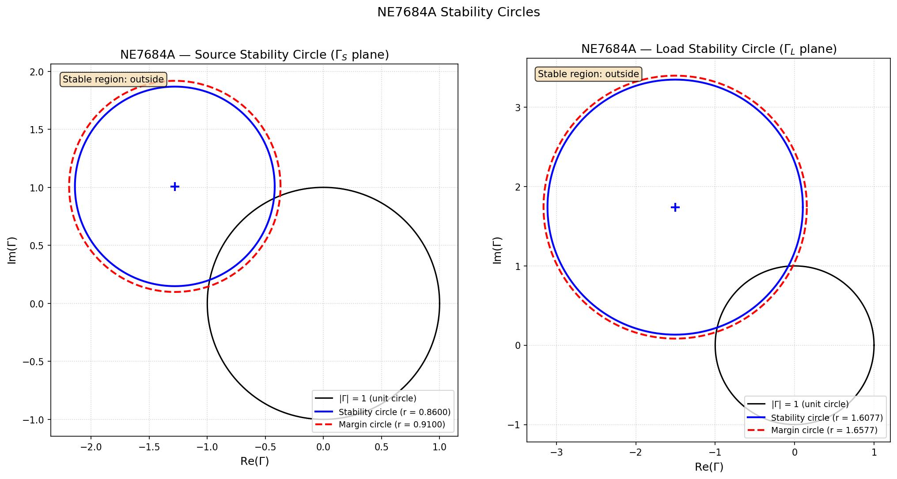
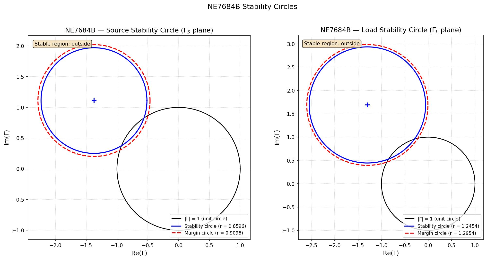
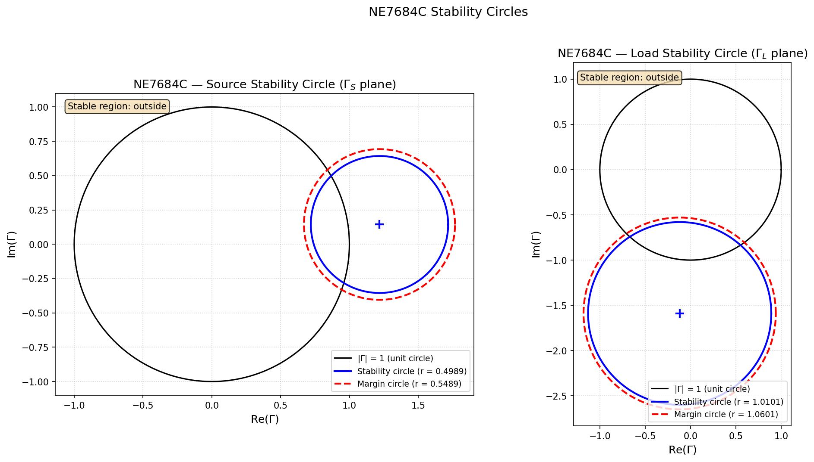

Step 3: Gain Circles

### Available Gain Circle Equations

The **available gain** $G_A$ contours are used here as a *design/visualization tool* to show what gain levels are achievable as a function of $\Gamma_S$ under the common “available gain” assumption that the output is conjugate matched (i.e., $\Gamma_L = \Gamma_{out}^\*$). Under this assumption, constant-$G_A$ contours in the $\Gamma_S$ plane are circles. I use the normalized gain $g_A = G_A / |S_{21}|^2$ (with $G_A$ in linear form) and set $g_A = \text{constant}$ to compute each circle’s center and radius.

**Definitions:**
- $C_1 = S_{11} - \Delta S_{22}^*$
- $g_A = G_A / |S_{21}|^2$ where $G_A$ is linear (convert from dB via $G_{A,\text{lin}} = 10^{G_{A,\text{dB}}/10}$)

**For each constant gain level $G_A$:**
- Denominator: $D_A = 1 + g_A\,(|S_{11}|^2 - |\Delta|^2)$
- **Center** (in the $\Gamma_S$ plane): $c_A = \dfrac{g_A\,C_1^*}{D_A}$
- **Radius**: $r_A = \dfrac{\sqrt{1 - 2k\,|S_{12}S_{21}|\,g_A + (|S_{12}S_{21}|\,g_A)^2}}{|D_A|}$

These circles are drawn in the **$\Gamma_S$ (source) plane** because available gain depends on the source reflection coefficient when the load is conjugate-matched.

### Gain Levels and Implementation

I draw gain circles at **18, 19, 20, 21, 22, 23, and 24 dB** to cover the requirement ($G_A > 18\,\text{dB}$) and higher design options. The calculations are implemented in `calculation/calculations.py` and the plots are generated by `calculation/graphs.py`. Each figure overlays the input stability circle and margin circle so that the intersection of gain and stability constraints is visible.

### Computed Results

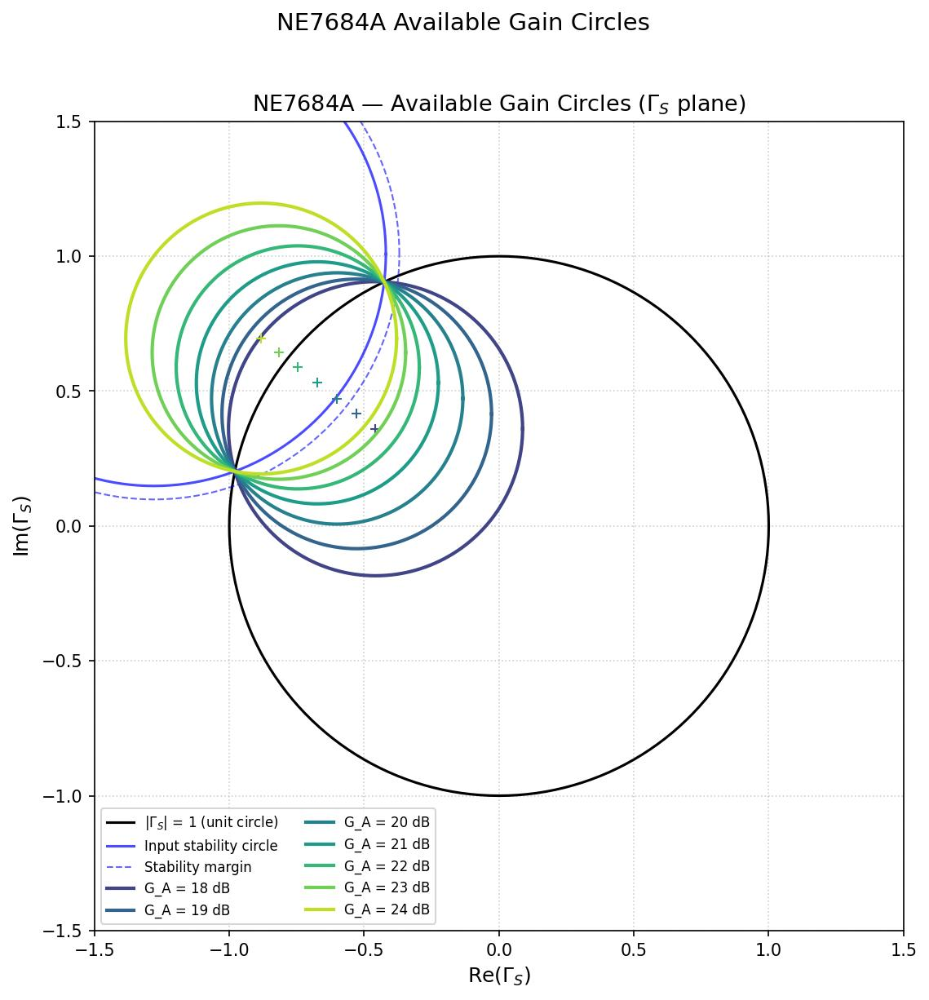
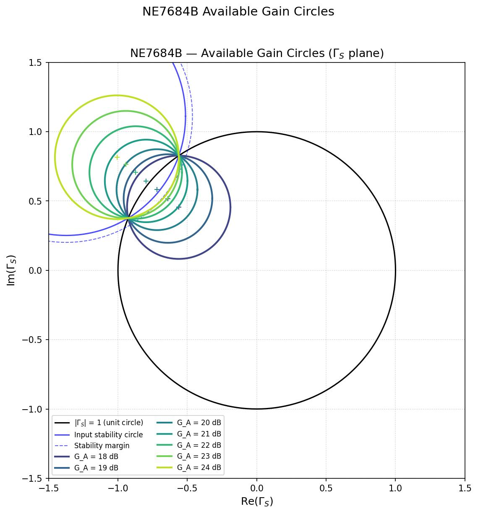
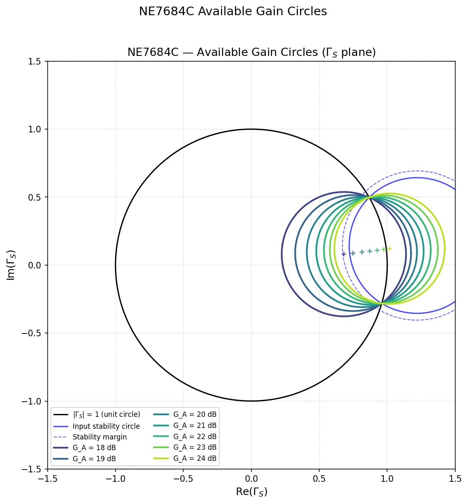

Step 4: Noise Circles

### Noise Figure Circle Equations

The device noise is described by four **noise parameters** at 1 GHz: minimum noise figure $NF_{min}$, optimum source reflection coefficient $\Gamma_{opt}$, and normalized noise resistance $R_n/Z_0$. The noise figure depends on the source reflection coefficient $\Gamma_S$, so constant-noise-figure contours are drawn in the **$\Gamma_S$ plane**.

Convert noise figures from dB to linear noise factors:

$$
F = 10^{NF/10}, \qquad F_{min} = 10^{NF_{min}/10}
$$

The noise factor as a function of $\Gamma_S$ is:

$$
F(\Gamma_S) = F_{min} + \frac{4(R_n/Z_0)\,|\Gamma_S - \Gamma_{opt}|^2}{(1-|\Gamma_S|^2)\,|1+\Gamma_{opt}|^2}
$$

For a **constant** noise figure $F$, define the parameter:

$$
N = \frac{(F - F_{min})\,|1+\Gamma_{opt}|^2}{4(R_n/Z_0)}
$$

Then the constant-noise-figure circle has:

$$
c_N = \frac{\Gamma_{opt}}{1+N},
\qquad
r_N = \frac{\sqrt{N^2 + N(1-|\Gamma_{opt}|^2)}}{|1+N|}
$$

### 1.7 dB Circle and Direction to Lower Noise

The project requirement is **NF $\leq 1.7$ dB**, so I plot the **1.7 dB** noise circle for each device using the noise parameters in `calculation/constants.py` and the equations above (implemented in `calculation/calculations.py`, plotted in `calculation/graphs.py`).

**Minimum noise occurs at $\Gamma_S = \Gamma_{opt}$.** Moving **toward $\Gamma_{opt}$** reduces noise figure; moving **away** increases noise figure. On each plot I mark $\Gamma_{opt}$ and draw an arrow pointing toward it (labeled “Lower NF”).

### Computed Results

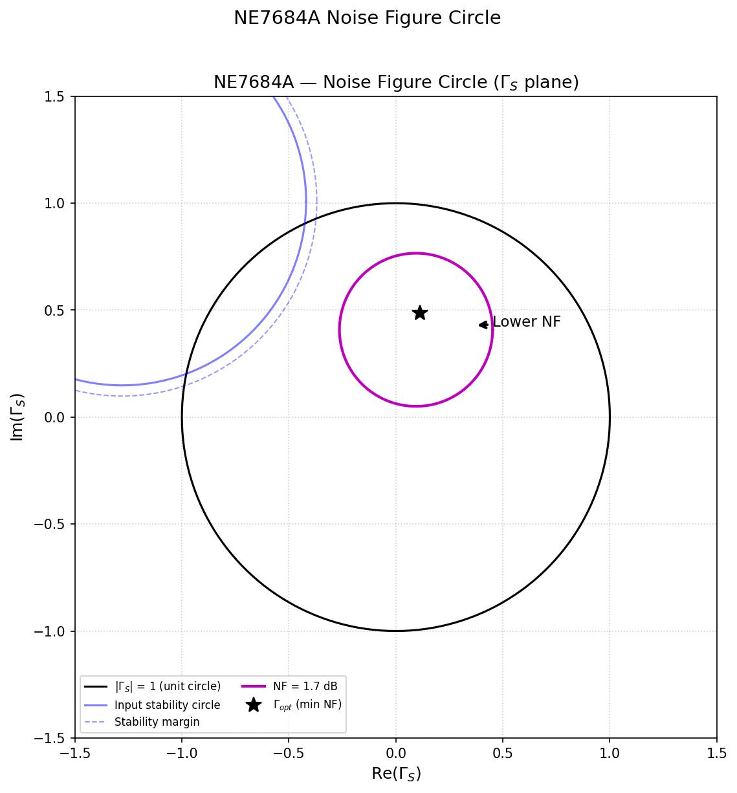
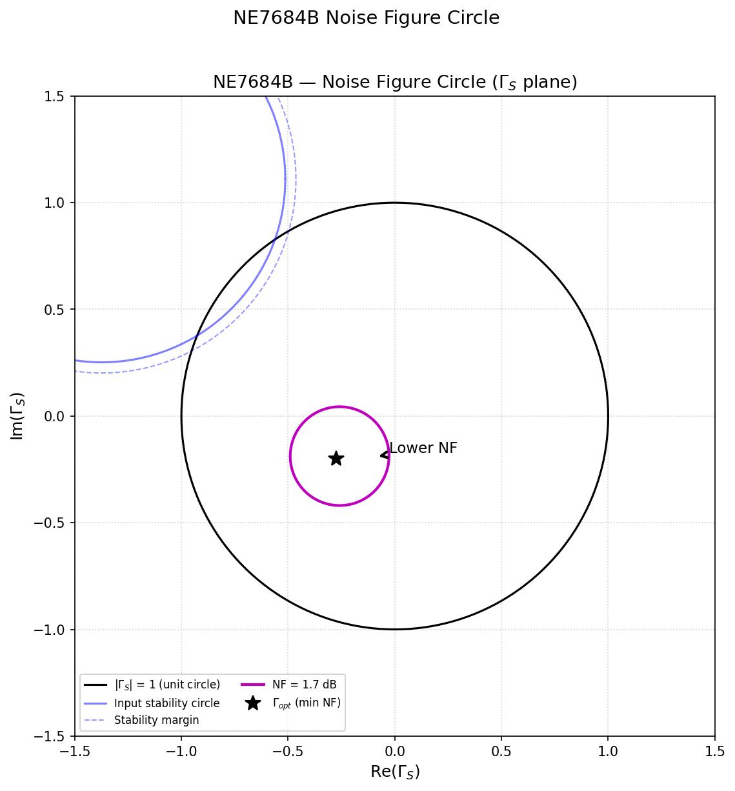
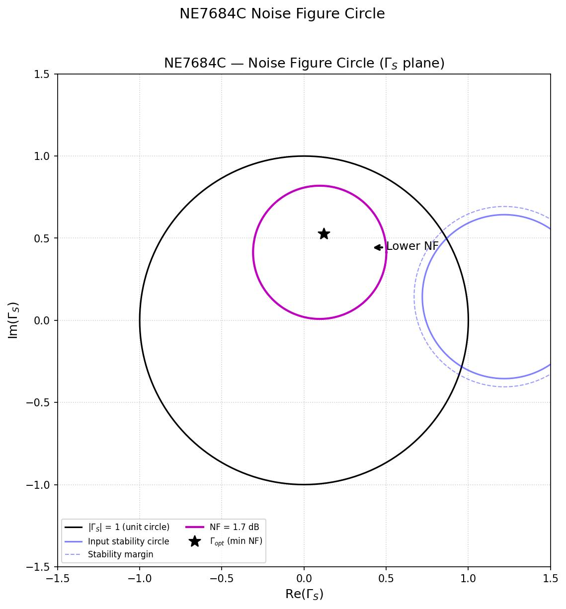

Step 5: Selecting the Device

### Combined Constraint Plots

To select the best device, I overlay **gain circles (18–24 dB)**, the **NF = 1.7 dB** noise circle, and the **input stability + margin** circle in the **$\Gamma_S$ plane**, and also show the **output stability + margin** circle in the **$\Gamma_L$ plane** (right subplot). This makes it easy to see whether there is a feasible $\Gamma_S$ region that can meet **gain**, **noise**, and **stability margin** simultaneously.

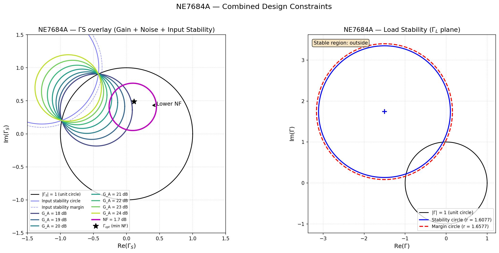
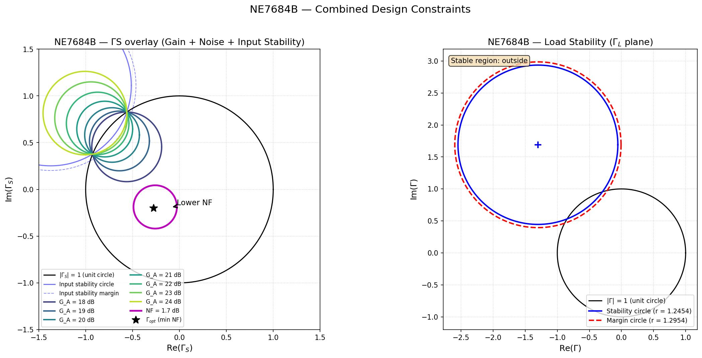
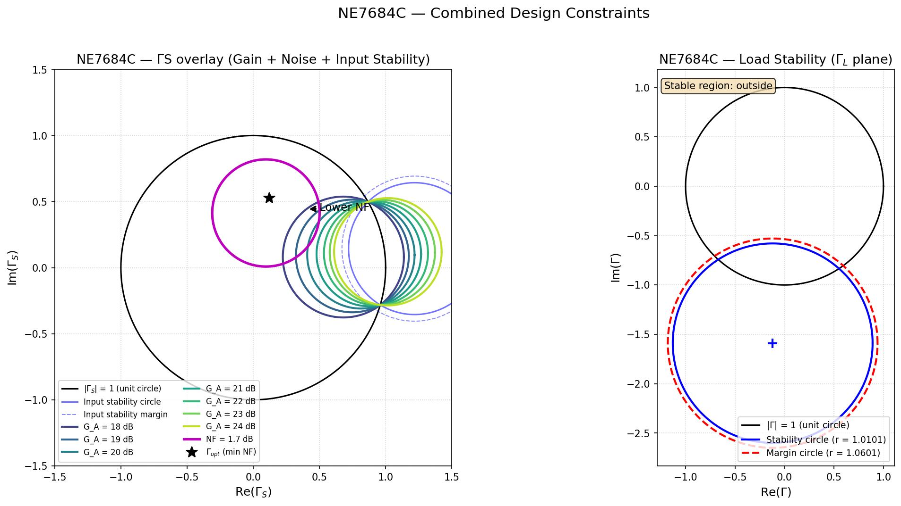

### Device Choice

From the combined plots and the provided 1 GHz parameters:

- **NE7684A (selected)**: offers the best tradeoff because it has the **highest forward gain** (largest $|S_{21}|$) and the **lowest $NF_{min}$**. In the $\Gamma_S$ overlay plot there is a clear overlap between the **NF $\le 1.7$ dB** region and the available-gain circles, and the NF boundary extends into part of the **$\sim$21 dB** gain-circle region.

- **NE7684B (rejected)**: is not feasible for the requirements because the **$G_A=18$ dB** gain circle does **not** overlap with the region that satisfies **NF $\le 1.7$ dB**. This means there is no $\Gamma_S$ that meets both the gain and noise requirements at the same time.

- **NE7684C (works but worse)**: can work, but has a **smaller overlap** region and a worse tradeoff. For example, the NF boundary only extends to about the **$\sim$20 dB** gain-circle region. NE7684C also has the **lowest $k$** (least stable), so meeting constraints like **$\mathrm{VSWR}_{IN}$** during tuning is likely harder.

Therefore I proceed with **NE7684A** for the remaining design steps.

Step 6: Device Tuning

### Device Tuning Sweep (joint $\Gamma_S$–$\Gamma_L$ tradeoffs)

For the selected device (**NE7684A**) at $1\,\text{GHz}$, I perform a **joint device-plane sweep** over both $\Gamma_S$ and $\Gamma_L$ to find a termination pair that satisfies the hard requirements on gain, noise, stability margin, and input VSWR.

#### Why the sweep must be joint
Forcing $\Gamma_L=\Gamma_{out}^*$ is a gain-driven (available-gain) assumption and does not generally minimize $|\Gamma_{in}|$. Since $\mathrm{VSWR}_{INPUT}<3{:}1$ is critical, $\Gamma_S$ and $\Gamma_L$ must be tuned together to meet gain/noise while keeping the device-plane input mismatch small enough.

#### Device-plane input VSWR check
For each candidate $\Gamma_L$, I compute the terminated two-port input reflection coefficient

$$
\Gamma_{in}=S_{11}+\frac{S_{12}S_{21}\Gamma_L}{1-S_{22}\Gamma_L}
$$
and compute the corresponding device-plane input VSWR:

$$
\mathrm{VSWR}_{IN,\text{device}}=\frac{1+|\Gamma_{in}|}{1-|\Gamma_{in}|}
$$
During Step 6 I require $\mathrm{VSWR}_{IN,\text{device}}<3$ as a feasibility check. The final **external-port** VSWR requirements are still verified after synthesizing the matching networks in later steps.

#### Gain and noise metrics
- **Gain constraint:** because Step 6 varies *both* terminations, I enforce the gain requirement using the **transducer gain** $G_T(\Gamma_S,\Gamma_L)$ of the terminated two-port (this is the gain that actually depends on both $\Gamma_S$ and $\Gamma_L$).
- **Noise constraint:** I enforce $NF(\Gamma_S)\le1.7\,\text{dB}$ using the device noise parameters.
- **Link to Step 3 plots:** I still use the **available gain** circles (Step 3) as a visualization aid in the $\Gamma_S$ plane, but the joint sweep feasibility is evaluated with $G_T$.

#### Stability margins
I enforce the stability margin constraints using signed distance to the stability-circle boundaries in both planes:
- source plane uses $\Gamma=\Gamma_S$
- load plane uses $\Gamma=\Gamma_L$
with the requirement that both margins are $\ge 0.05$.

#### Sweep and refinement outputs
I run a coarse joint sweep over stable regions and then refine locally around the best feasible point.

Outputs are saved as:
- `documentation/NE7684A_step6_joint_sweep.csv`
- `documentation/NE7684A_step6_joint_refined.csv`
- `documentation/NE7684C_step6_joint_sweep.csv`

All feasible points satisfy the hard constraints (gain $>18\,\text{dB}$, $NF\le1.7\,\text{dB}$, $\mathrm{VSWR}_{IN,\text{device}}<3$, and stability margins $\ge 0.05$). Since stability is enforced as a hard constraint, I rank feasible points primarily by **gain**, then **noise figure**, then **VSWR**:

1. higher gain
2. lower $NF$
3. lower $\mathrm{VSWR}_{IN,\text{device}}$

**NE7684A best coarse feasible point (ranked):**
- $\Gamma_S \approx -0.2500 + j0.4330$
- $\Gamma_L \approx 0.9356 - j0.1650$
- gain $\approx 21.16\,\text{dB}$, $NF \approx 1.63\,\text{dB}$, $\mathrm{VSWR}_{IN,\text{device}} \approx 2.40$
- stability margins: $m_{in}\approx 0.319$, $m_{out}\approx 1.488$

**NE7684A best refined feasible point (ranked):**
- $\Gamma_S \approx -0.2600 + j0.4530$
- $\Gamma_L \approx 0.9856 - j0.1650$
- gain $\approx 21.32\,\text{dB}$, $NF \approx 1.70\,\text{dB}$, $\mathrm{VSWR}_{IN,\text{device}} \approx 2.35$
- stability margins: $m_{in}\approx 0.301$, $m_{out}\approx 1.528$

#### Comparison to NE7684C

I repeated the same coarse joint $\Gamma_S$–$\Gamma_L$ sweep for **NE7684C** under the same hard constraints. On the coarse grid, **NE7684C produced no feasible points**, meaning it could not simultaneously satisfy the gain, noise, VSWR, and stability-margin constraints at 1 GHz. Device C is not an attractive design choice because the overlap between the low-noise region and the required available-gain region is very limited in the $\Gamma_S$ plane, and the corresponding $\Gamma_L$ choices are further constrained by the output stability circle. Therefore, satisfying gain, NF, and both stability-margin requirements simultaneously is difficult, making Device C unsuitable compared with the better alternatives.

This confirms that **NE7684C has worse Step 6 tuning feasibility than NE7684A** under the project specifications.

Step 7: Select the optimum input $\Gamma_S$

### Definition of “optimum” and hard constraints
Here I use $\Gamma_S$ (same as $\Gamma_s$ in the project statement) to denote the source/input reflection coefficient. The optimum $\Gamma_S$ is selected from the feasible region in the $\Gamma_S$ plane that simultaneously satisfies:

- **Gain**: $G_T(\Gamma_S,\Gamma_L) > 18\,\text{dB}$
- **Noise**: $NF(\Gamma_S)\le 1.7\,\text{dB}$
- **Input-plane stability margin**: $m_{in}\ge 0.05$ (per the stability-margin construction in Step 2)
- **Critical input mismatch feasibility (device plane):** the Step 6 device-plane check $\mathrm{VSWR}_{IN,\text{device}}<3$ (equivalently $|\Gamma_{in}|<0.5$).

Since $\Gamma_{in}$ depends on $\Gamma_L$, this selection is based on the **joint** $\Gamma_S$–$\Gamma_L$ feasible set computed in Step 6. Among feasible points (all hard constraints met), I rank candidates by: (1) higher gain, then (2) lower $NF$, then (3) lower $\mathrm{VSWR}_{IN,\text{device}}$.

### Selected optimum $\Gamma_S$
From the refined joint sweep for **NE7684A**, the optimum input termination is:

- $\Gamma_S^\star \approx -0.2600 + j0.4530$

At this point the design meets all hard constraints:
- gain $\approx 21.32\,\text{dB}$
- $NF \approx 1.70\,\text{dB}$
- $\mathrm{VSWR}_{IN,\text{device}} \approx 2.35$ (i.e., $|\Gamma_{in}|<0.5$)
- input stability margin: $m_{in}\approx 0.301\ge 0.05$

Step 8: Select the corresponding $\Gamma_L$ and verify stability requirements

The corresponding output termination for the selected $\Gamma_S^\star$ (from the same refined feasible optimum) is:

- $\Gamma_L^\star \approx 0.9856 - j0.1650$

### Output-plane stability margin verification
Using the output stability circle and margin circle defined in Step 2, $\Gamma_L^\star$ must lie in the **stable region** and satisfy the required stability margin:

- output stability margin: $m_{out}\approx 1.528\ge 0.05$

### Note on the $\mathrm{VSWR}_{OUT}=1{:}1$ requirement
The project requirement $\mathrm{VSWR}_{OUT}=1{:}1$ is an **external-port** requirement. In Steps 9–10, the output matching network will be synthesized to present the device with $\Gamma_L^\star$ while maintaining a matched $50\,\Omega$ output port.

### Step 9 matching network topology choice (balanced 100 $\Omega$ open stubs on a 50 $\Omega$ line)
At 1 GHz with $Z_0=50\,\Omega$, the selected reflection coefficients correspond to the following target impedances at the device reference planes:

$$
Z_S^\star = Z_0\frac{1+\Gamma_S^\star}{1-\Gamma_S^\star}\approx (20.3 + j25.3)\,\Omega
$$

$$
Z_L^\star = Z_0\frac{1+\Gamma_L^\star}{1-\Gamma_L^\star}\approx (2.50 - j602)\,\Omega
$$

Per the project constraint, I implement both matching networks using a **50 $\Omega$ through line** and **balanced open stubs** with characteristic impedance **$Z_{0,stub}=100\,\Omega$**. “Balanced” means **two identical 100 $\Omega$ open stubs in parallel at the same shunt node** (symmetric layout, doubled susceptance).

For an open-circuited stub of characteristic impedance $Z_{0,stub}$ and electrical length $\theta=\beta l$, the input admittance is:

$$
Y_{stub}=j\frac{1}{Z_{0,stub}}\tan(\theta)
$$

Two identical stubs in parallel give:

$$
Y_{eq}=2Y_{stub}=j\frac{2}{100}\tan(\theta)=j\frac{1}{50}\tan(\theta)
$$

So, **when normalized to 50 $\Omega$**, the balanced stub pair contributes a **pure shunt susceptance**

$$
y_{eq}=j\tan(\theta)
$$
This is equivalent (in normalized admittance) to a **single 50 $\Omega$ open stub** at the same electrical length.

### Distributed matching network form used in Step 9
On each Smith chart I use a distributed two-element form that is directly realizable with microstrip:

- **Series 50 $\Omega$ line section(s)** (electrical length $\theta$): moves along a constant-$|\Gamma|$ circle (phase rotation).
- **Shunt balanced open-stub pair** (two identical 100 $\Omega$ stubs of electrical length $\theta_s$ at one node): adds a pure susceptance in the **admittance** plane, $y\rightarrow y + j\tan(\theta_s)$.

This provides the same degrees of freedom as an L-match, but implemented with the required **50 $\Omega$ line + balanced 100 $\Omega$ open stubs**.

#### Verification notes (constraints carried forward)
- **Device-plane feasibility (chosen terminations):** verify $|\Gamma_{in}(\Gamma_L^\star)|<0.5$ (equivalently $\mathrm{VSWR}_{IN,\text{device}}<3$).
- **Output-plane stability margin:** $\Gamma_L^\star$ must satisfy the Step 2 margin requirement in the $\Gamma_L$ plane (already $m_{out}\approx 1.528$ for the selected point).
- **External-port match (after synthesis):** verify $\mathrm{VSWR}_{IN}$ and $\mathrm{VSWR}_{OUT}$ at the external $50\,\Omega$ ports for the full network.

Step 9: Smith-chart design of the input and output matching networks

To synthesize the matching networks, I use **two separate Smith charts** (one in the $\Gamma_S$ plane for the input match and one in the $\Gamma_L$ plane for the output match). Each chart shows the target reflection coefficient at 1 GHz (from Step 7–8) and one matching trajectory realizable with the required **series 50 $\Omega$ line section(s)** and **shunt balanced 2×100 $\Omega$ open stubs**.

**Input (gate) Smith chart ($\Gamma_S$ plane):** the trajectory uses a **50 $\Omega$ series line** and a **balanced shunt open-stub pair (2× 100 $\Omega$)** to transform from the 50 $\Omega$ port to $\Gamma_S^\star$. (The shunt element is symmetric by construction because the two stubs are identical.) One valid electrical-length solution at 1 GHz is:

- series 50 $\Omega$ line before stubs: $\theta_1 = 0^\circ$
- each 100 $\Omega$ open stub: $\theta_s \approx 50.75^\circ$  
- series 50 $\Omega$ line after stubs: $\theta_2 \approx 59.34^\circ$  

With the balanced pair, the normalized shunt susceptance is $y_{eq}=j\tan(\theta_s)\approx j(1.224)$ at the shunt node.

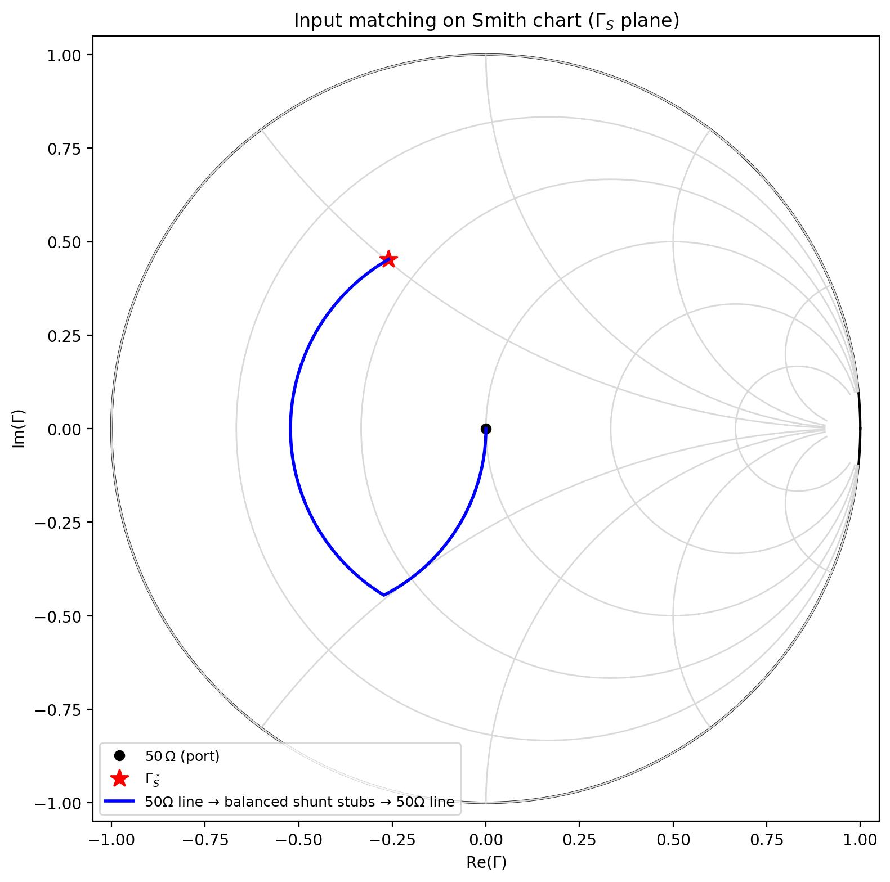

**Output (drain) Smith chart ($\Gamma_L$ plane):** the trajectory uses the same building blocks (50 $\Omega$ series line + balanced 2×100 $\Omega$ open-stub shunt node) to present $\Gamma_L^\star$ at the device plane while keeping the external output port matched to 50 $\Omega$. One valid electrical-length solution at 1 GHz is:

- series 50 $\Omega$ line before stubs: $\theta_1 = 0^\circ$ *(arbitrary here since the start point is $\Gamma=0$)*  
- each 100 $\Omega$ open stub: $\theta_s \approx 89.00^\circ$  
- series 50 $\Omega$ line after stubs: $\theta_2 \approx 95.75^\circ$  

This output match is very reactive/high-Q (the target $\Gamma_L^\star$ is close to the unit circle), so the stub length lands close to $\lambda_g/4$ and the result will be more layout-sensitive and narrowband than the input match.

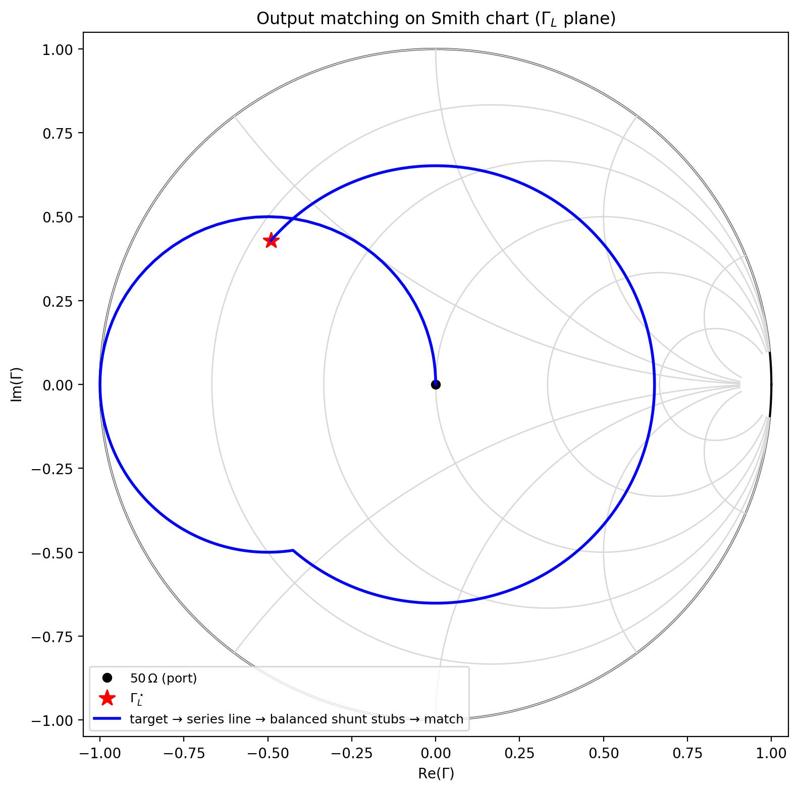

Step 10 (handoff): MIC realization of the Step 9 microstrip sections

In Step 10, I convert the Step 9 electrical lengths to **physical microstrip lengths** on Rogers substrate ($\varepsilon_r=4$, $h=0.254\,\text{mm}$) using the provided microstrip design curves:

- **Determine widths** from the design curves:
  - $W_{50}$ for a 50 $\Omega$ microstrip line (through line sections)
  - $W_{100}$ for a 100 $\Omega$ microstrip line (each open stub)
- **Determine guided wavelength** for each impedance class (because $W/h$ differs):
  - $\lambda_{g,50}$ for the 50 $\Omega$ line
  - $\lambda_{g,100}$ for the 100 $\Omega$ stub line
- **Convert electrical length to physical length**:

$$
l=\frac{\theta}{2\pi}\,\lambda_g
$$

Using $\lambda_{g,50}$ for the 50 $\Omega$ sections ($\theta_1$, $\theta_2$) and $\lambda_{g,100}$ for each 100 $\Omega$ open stub ($\theta_s$).

